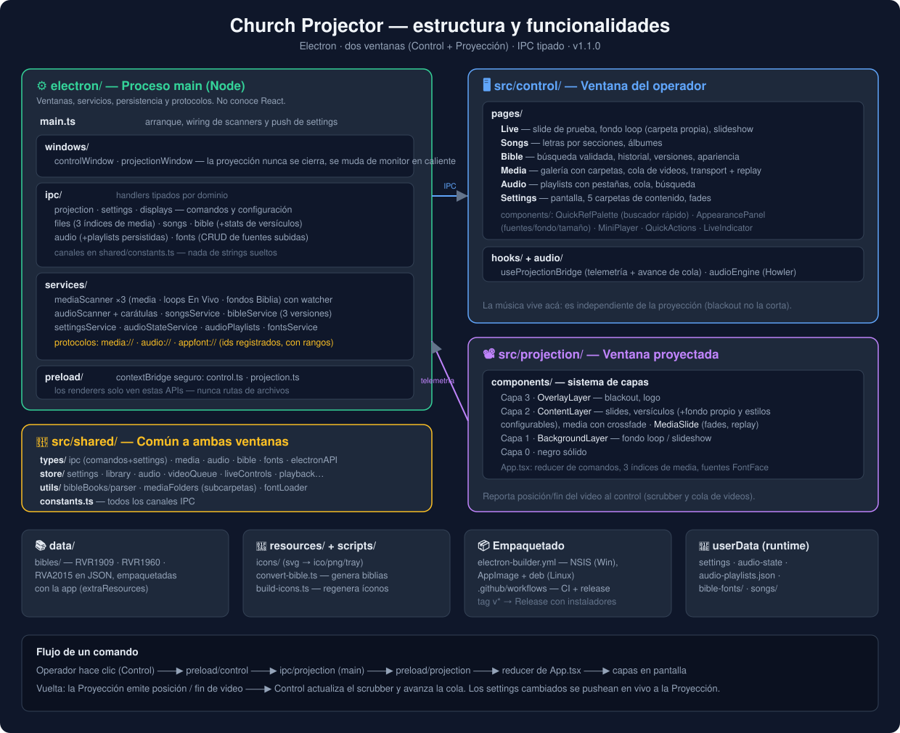

# Church Projector

App de escritorio para proyección en iglesias. Muestra letras de canciones, versículos bíblicos, imágenes, videos y GIFs en una segunda pantalla, con reproducción de música de fondo independiente.

**Plataformas:** Windows · Linux &nbsp;·&nbsp; **Versión actual:** 1.1.0

## Funcionalidades

### 🎬 En Vivo
- Slide de prueba editable y proyección instantánea.
- **Fondo único en loop** (video o imagen) detrás del contenido, con carpeta dedicada configurable y navegación por subcarpetas.
- **Presentación de fondo**: slideshow de imágenes en loop con intervalo configurable.
- Acciones rápidas siempre visibles: Detener todo, Blackout, Logo, Clear.

### 🎵 Canciones
- Biblioteca de canciones con secciones (verso, coro, puente) y álbumes.
- Proyección por slides con navegación por teclado.

### 📖 Biblia
- 3 versiones incluidas: RVR1909, RVR1960, RVA2015 (español).
- **Búsqueda rápida por teclado**: escribís en cualquier parte de la pestaña y se abre el palette (libro → capítulo → versículo, con rangos `16-18`).
- **Validación real**: solo deja tipear capítulos y versículos que existen en la versión cargada; el buscador de texto avisa los rangos disponibles.
- Historial de versículos recientes y versión predeterminada (estrella).
- **Apariencia configurable de la proyección** (botón *Apariencia*):
  - Fuentes personalizadas — subí archivos de Google Fonts (`.ttf`, `.otf`, `.woff`, `.woff2`); funcionan sin internet.
  - Tamaño del texto (50–200 %), color, negrita y sombra.
  - Fondo de versículos (imagen/video) con oscurecido regulable, desde una carpeta dedicada con subcarpetas.
  - Vista previa a escala y "Probar en proyección"; los cambios se aplican en vivo.

### 🖼️ Media
- Galería de imágenes, videos y GIFs con **navegación por carpetas y subcarpetas** (breadcrumb).
- **Cola de videos**: armá una lista ordenada que avanza sola al terminar cada clip, con precarga del siguiente.
- Transport del video en vivo: scrub, pausa, volumen, reinicio y **"De nuevo"** al terminar.
- Duración visible de cada video (`4m 12s` / `1h 05m 12s`).
- Fade de audio configurable a la entrada y salida de los videos.

### 🎧 Audio
- Reproductor de música independiente de la proyección (la música sigue aunque cambies de slide o hagas blackout).
- **Playlists con pestañas**: "Toda la música" + una pestaña por playlist; creación, renombrado, reordenado y borrado.
- Cola de reproducción, búsqueda, carátulas y persistencia de sesión (retoma donde quedaste).

### ⚙️ Ajustes
- Selección de pantalla de proyección (se reposiciona en caliente).
- Carpetas de contenido independientes: media general, loops de En Vivo, fondos de Biblia, música y canciones — todas con watcher (los archivos nuevos aparecen solos).
- Fades de audio de video con duración configurable.

## Estructura del proyecto



Detalle completo en [docs/ARCHITECTURE.md](docs/ARCHITECTURE.md).

```
churchApp/
├─ electron/            Proceso main: ventanas, IPC, servicios, protocolos
│  ├─ ipc/              Handlers IPC por dominio (media, biblia, audio, fuentes…)
│  ├─ services/         Scanners con watcher, persistencia, protocolos custom
│  ├─ preload/          Bridges seguros (contextBridge) para cada ventana
│  └─ windows/          Creación de las ventanas de control y proyección
├─ src/
│  ├─ control/          Ventana del operador (pestañas, reproductor, paneles)
│  ├─ projection/       Ventana proyectada (capas: fondo, contenido, overlay)
│  ├─ shared/           Tipos, stores Zustand, constantes y utilidades comunes
│  └─ styles/           Tailwind global
├─ data/bibles/         Biblias JSON incluidas en el paquete
├─ docs/                Documentación
├─ resources/icons/     Íconos de la app
└─ scripts/             Conversión de biblias y generación de íconos
```

## Inicio rápido

```bash
npm install
npm run dev
```

Ver [docs/DEVELOPMENT.md](docs/DEVELOPMENT.md) para scripts, alias y flujo de trabajo, y [docs/BUILD.md](docs/BUILD.md) para empaquetar instaladores.

## Documentación

| Documento | Contenido |
|---|---|
| [docs/USER_GUIDE.md](docs/USER_GUIDE.md) | Guía de uso para el operador, sección por sección |
| [docs/ARCHITECTURE.md](docs/ARCHITECTURE.md) | Arquitectura: ventanas, IPC, capas, protocolos, persistencia |
| [docs/DEVELOPMENT.md](docs/DEVELOPMENT.md) | Setup de desarrollo, scripts y convenciones |
| [docs/BUILD.md](docs/BUILD.md) | Builds locales y releases por GitHub Actions |
| [docs/BIBLE.md](docs/BIBLE.md) | Formato de las biblias y cómo agregar versiones |

## Stack

Electron · electron-vite · React 18 · TypeScript strict · Tailwind CSS · Zustand · Framer Motion · Howler.js · chokidar · electron-builder

## Licencia

MIT © 2026 ArielFerger
